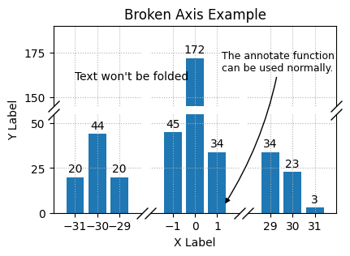
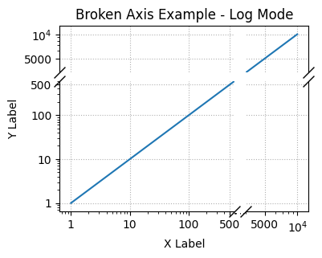

# mpl fold axis

This module provides a function `fold_axis` to fold axis in matplotlib, which is also
called broken axis.

Unlike the example named
[Broken axis](https://matplotlib.org/stable/gallery/subplots_axes_and_figures/broken_axis.html)
in matplotlib gallery and the [brokenaxes](https://github.com/bendichter/brokenaxes)
package, this module use single axes to realize the broken axis, which is easier to use.

## Installation

```bash
pip install mpl_fold_axis
```

## Example

Now this module only support linear and log mode, user could use different mode to fold
xaxis and yaxis in one axes.

### Linear broken axis



```python
import numpy as np
import matplotlib.pyplot as plt

# What user need to do is only import the `fold_axis` function.
from mpl_fold_axis import fold_axis

# Generate data
np.random.seed(19680801)
x = [-31, -30, -29, -1, 0, 1, 29, 30, 31]
y = np.random.randint(0, 50, 9)
y[4] = 172

# Create the figure and the axis
fig, ax = plt.subplots(figsize=(4.5, 3.0))

# Call `Axes.bar` to plot the data
rects = ax.bar(x, y)
ax.bar_label(rects, fmt="%d", padding=2)

# Fold the lower xaxis
# scale (-28, -2) by factor 0.015
# scale (2, 28) by factor 0.015
fold_axis(ax, [(-28, -2, 0.015), (2, 28, 0.015)], axis="x", which="lower")

# Fold both yaxis (lower and upper)
# scale (55, 145) by factor 0.05
fold_axis(ax, [(55, 145, 0.05)], axis="y", which="both")

# Set the ticks and limits
ax.set_xticks(x)
ax.set_yticks([0, 25, 50, 150, 175])
ax.set_ylim(0, 190)

# Enable the grid
ax.grid(True, ls=":")

# Set the labels and title
ax.set_xlabel("X Label")
ax.set_ylabel("Y Label")
ax.set_title("Broken Axis Example")

# Add some text and annotations
ax.text(-31, 160, "Text won't be folded")
ax.annotate(
    "The annotate function \ncan be used normally.",
    fontsize=9,
    xy=(1.3, 4),
    xytext=(1.2, 165),
    arrowprops=dict(
        facecolor="black", connectionstyle="arc3,rad=-0.1", arrowstyle="-|>"
    ),
)

plt.show()
```

### Log broken axis



```python
import numpy as np
import matplotlib.pyplot as plt

# What user need to do is only import the `fold_axis` function.
from mpl_fold_axis import fold_axis

x = np.logspace(0, 4, 100)
y = x

fig, ax = plt.subplots(figsize=(4,3))

ax.plot(x, y)

fold_axis(ax, [(600, 4000, 0.1)], mode="log")
# return the lines and rectangles objects.
lines, rectangles = fold_axis(ax, [(600, 4000, 0.1)], axis='y', which='both', mode="log")

ax.set_xticks([1, 10, 100, 500, 5000, 10000],
              [1, 10, 100, 500, 5000, r'$10^4$'])
ax.set_yticks([1, 10, 100, 500, 5000, 10000],
              [1, 10, 100, 500, 5000, r'$10^4$'])


ax.grid(ls=':')
ax.set_xlabel("X Label")
ax.set_ylabel("Y Label")
ax.set_title("Broken Axis Example - Log Mode")

plt.show()
```

## Dependencies

```bash
matplotlib>=3.6.0, <4.0.0
```

## Changelog

- 2025-03-29: v0.1.0, first release.
